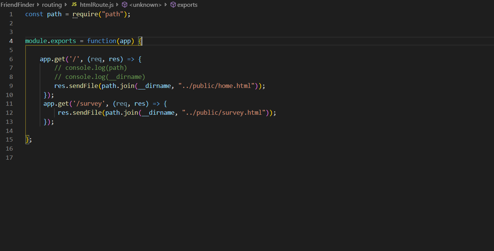
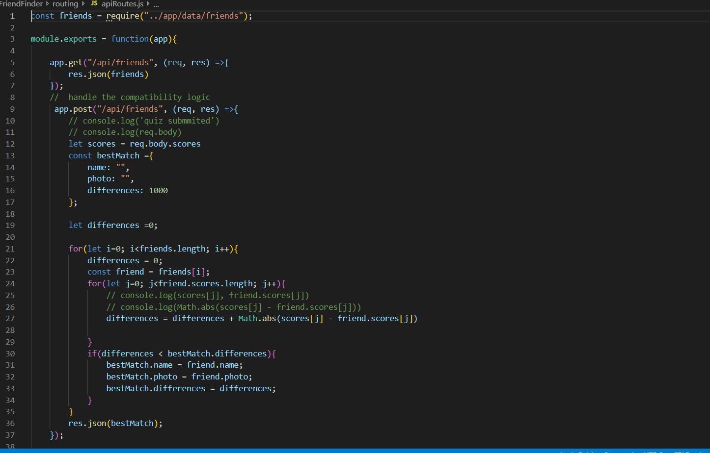
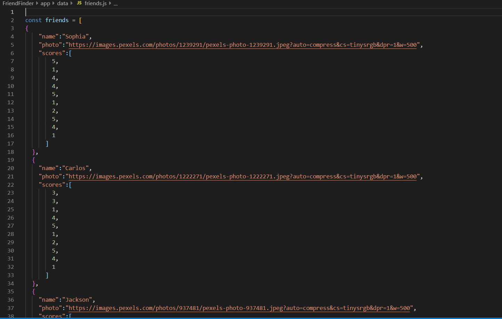
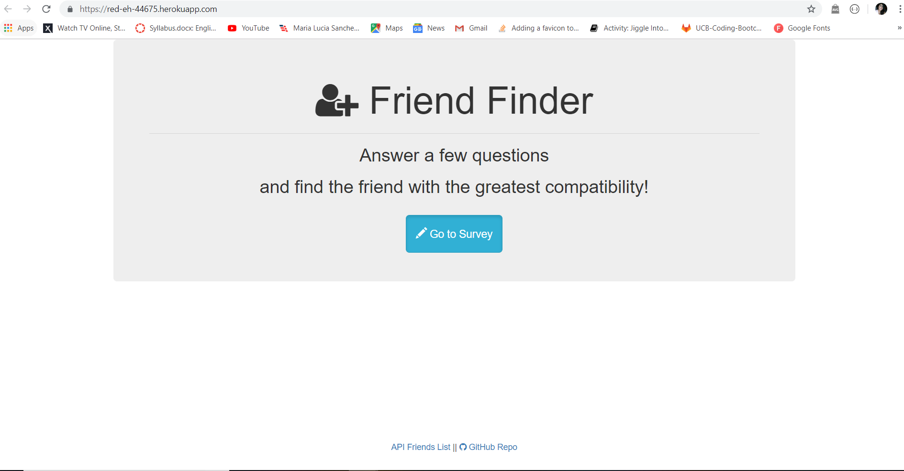
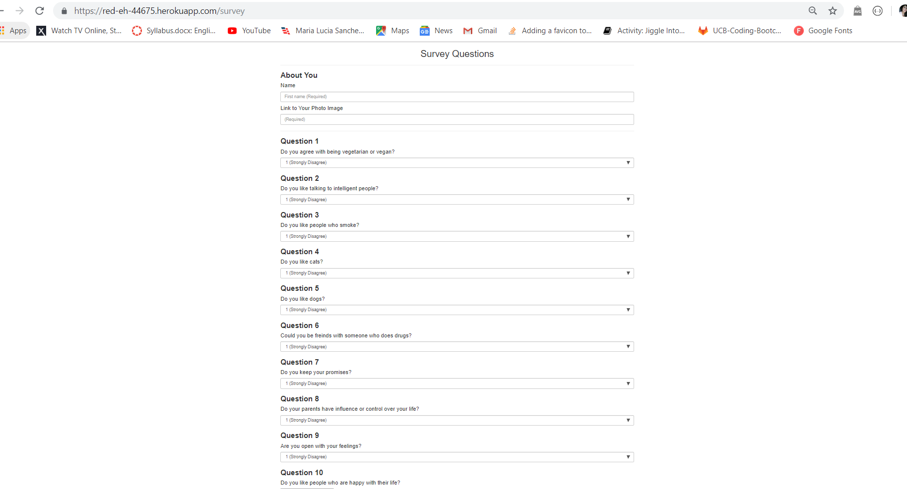
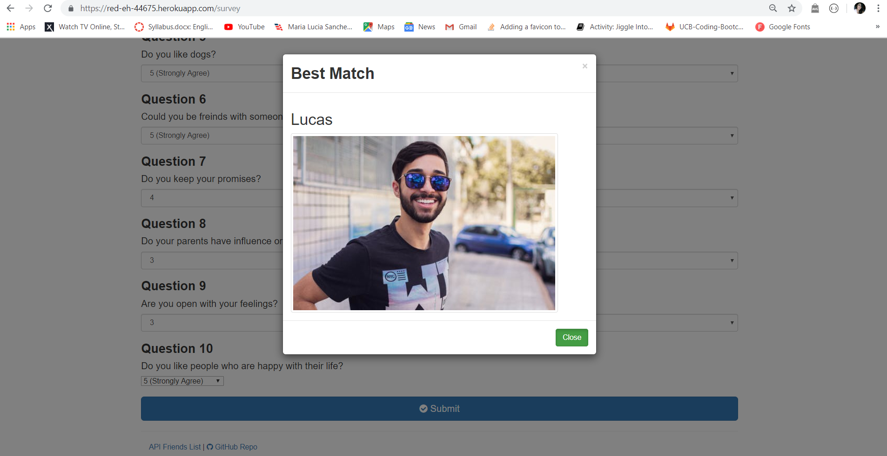

# Friend Finder - Node and Express Servers

FriendFinder is a basically a dating app. This full-stack site will take in results from your users' surveys, then compare their answers with those from other users. The app will then display the name and picture of the user with the best overall match.

In this app we have a survey with 10 questions on preferences. Each answer is on a scale of 1 to 5 based on how much the user agrees or disagrees with a question. Based on that they will have a result with the best match for a friend.

1. npm installations in our server.js:

express and path.

2. HtmlRoutes.js file includes two routes:

GET Route to /home & /survey.

3. ApiRoutes.js file contains two routes:

GET route with the url /api/friends. This displays a JSON of all possible friends.
A POST routes /api/friends. This handles incoming survey results and the compatibility logic to get the best match.

We created our own API database (app/data/friends.js) as an array of objects to get the best match as a result on the survey.

Overall look of the app:

Home Page:

Survey Page:

Best Match result Page:

________________________________________________________________________________________________

If you want to see the code of this application, follow the steps below:

## Quick Start

1.  Clone the repo ``
2.  Go to your project folder from your terminal
3.  Run: `npm install` or `yarn install`
4.  After install, run: `npm run start` or `yarn start`
5.  It will open your browser(http://localhost:3000)

Or Live Preview: https://friend-finder-app-website.herokuapp.com/
